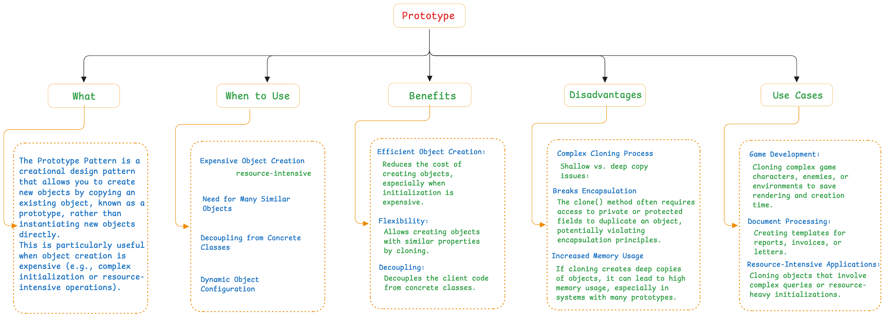

## Design Patterns
    Java Design Patterns

#### What is a Design Pattern?

#### Why Design Pattern?

#### Types of Design Pattern?

#### Creational Design Pattern?

#### Prototype Design Pattern?

#### Prototype Design Pattern Example?

#### Singleton Design Pattern?

#### Singleton Design Pattern Example?

#### Factory Design Pattern?

#### Factory Design Pattern Example?

#### Abstract Factory Design Pattern?

#### Abstract Factory Design Pattern Example?
